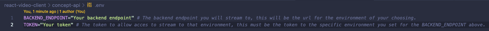
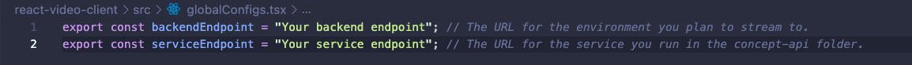

### Prerequisites

Before you begin, ensure you have the following:

- [Node.js](https://nodejs.org/) installed (latest stable version recommended).
- A 'Video-Client' backend endpoint URL for streaming. You will need to replace the placeholder URL in the configuration.
- The ability to deploy a backend service or run one locally for testing purposes

## Backend Service (concept-api folder)

The concept-api, or backend service, serves multiple purposes, for this demo it will show you how to handle requests to both our LSI(Large Scale Integration) and Foundation Auth APIs. To begin please follow the steps below, for local demoing purposes this can be ran locally, for non-local purposes this will need to be deployed somewhere. **This demo service is not designed for production purposes**.

1\. The first step in getting the service running up and running is to configure your **.env** file. You will see two separate environment variables in this file, **BACKEND_ENDPOINT** and **TOKEN**. For the **BACKEND_ENDPOINT** you will want to add the backend endpoint for the environment you plan on streaming and viewing from, for the **TOKEN** you will need to add the access token of the environment you set for your **BACKEND_ENDPOINT**. If you do not have access to either of these please reach out to support.


2\. Next install the applications dependencies using npm at the root directory of the concept api. (concept-api folder):
```bash
npm install
```

3\. Finally if everything is configured properly you can begin the service using npm at the root directory of the the concept-api.(concept-api folder): 
```bash
npm run start
```

## Video Client (react-video-client folder)
The react-video-client demo is the front end section of our demo using React. This demo connects to the Video Client Core and Web libraries in order to create our Encoder and Manifest Player. This is a very basic level demo that is used to showcase the basic features of Video Client and how it functions. **This demo is not designed for production purposes**.

1\. To begin you will need to configure your **backend endpoint** and your **service endpoint**, this needs to be done in the **globalConfigs.tsx** file found at **react-video-client/src/globalConfig.tsx**. The **service endpoint** is the endpoint you created in the backend service steps you followed above, if you have not completed the Backend Service section of this Readme or have your own service you intend to use please start there. The **backend endpoint** is the environment to which you would like to stream and play video from.


2\. Now that everything is configured, install the application dependencies using npm at the root directory of the application (react-video-client folder):
```bash
npm install
```

3\. Finally the application is ready to be ran, start the application using npm at the root directory of the application (react-video-client folder):
```bash
npm run start
```

4\. Once the application is up and running you will have both an Encoder and Manifest Player running:
  - Encoder URL: http://localhost:3000
  - Manifest URL: http://localhost:3000/manifest